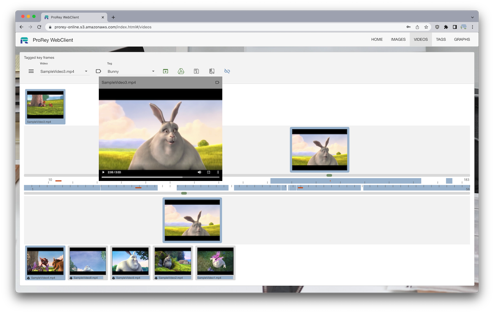
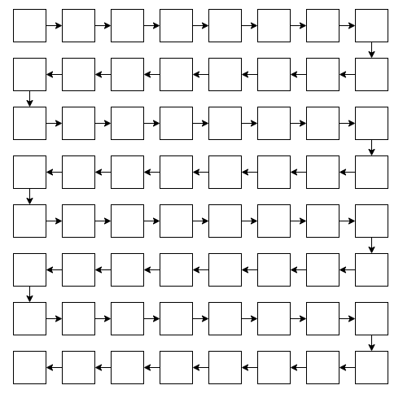
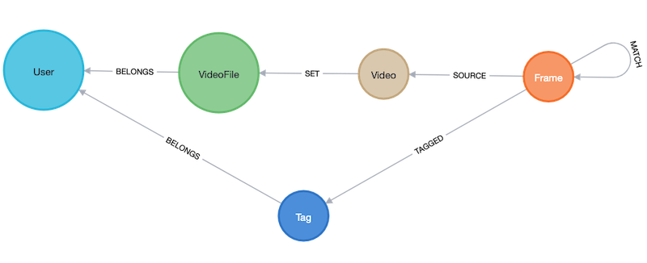
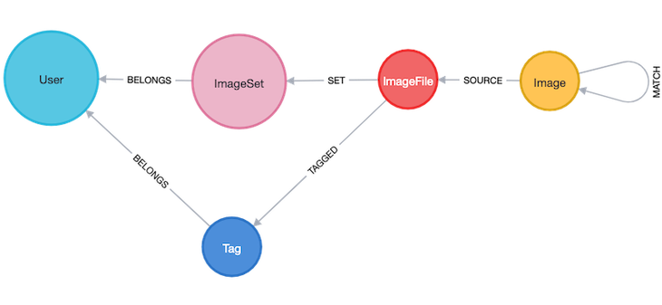
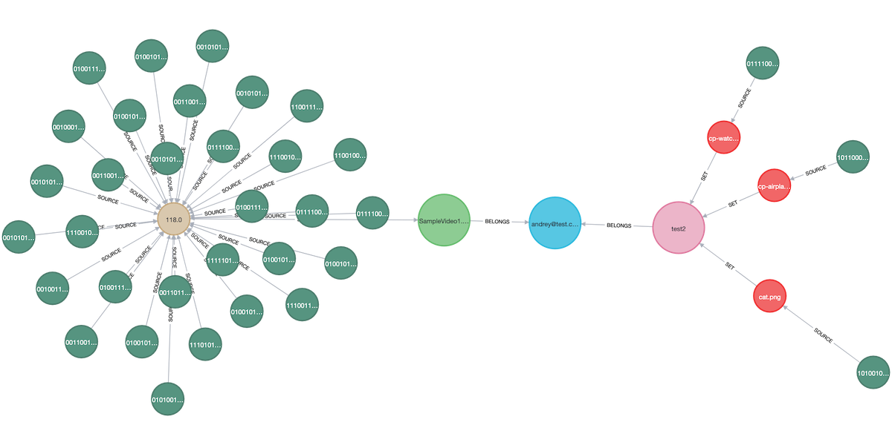

# ProRey Online


by [ProRey Tech](https://prorey.com)



**ProRey Online** [prorey.online](https://prorey.online) is Online Application for Image and Video tagging and comparison. User can select Image and Video files from Local, Network or Google Drive, and compare them to each other. File metadata can be saved in a cloud collection for later comparison. Images and Video frames can be tagged and links between them can be analyzed with graph visualizations.

ProRey Online generates Image and Video dHashes locally without uploading media files to cloud server. This makes dHashes comparison on cloud fast, private and secure. dHashes are stored and matched in graph database which makes storage horizontally scalable. Search time is dependent only on number of images or video frames in collection.

ProRey Online is developed with modern serverless cloud **NAVEN** stack. New features can be added rapidly with JavaScript-based languages and cloud infrastructure cost is proportional to number of hashes stored. All modern browsers are supported.

**NAVEN** stands for Neo4J, AngularJS, VisJS, ExpressJS and NodeJS

### Why Single Page Web Application

*   Nothing to download, nothing to install, no more desktop application updates
*   Server side processing when needed, sharing data and collaboration between users
*   Billing, analytics built in
*   Less expensive to develop and scales horizontally

**NodeJS** is a JavaScript back-end runtime used to authenticate client requests and interact with database.

 [nodejs.org](https://nodejs.org)

**ExpressJS** is a minimal and flexible Node.js web application framework.

 [expressjs.com](https://expressjs.com)

**AngularJS** is popular JavaScript-based front-end web application framework

 [angularjs.org](https://angularjs.org)

### Why GraphDB

**Neo4J AuraDB** graph database provides:

*   **Performance** For intensive data relationship handling, graph database improves performance by several orders of magnitude. Graph database performance stays constant when data grows.
*   **Flexibility** With graph databases the structure and schema of a graph model flexes as application changes. Can add to the existing graph structure without endangering current functionality.
*   **Agility** Frictionless development and maintenance.
*   **Free hosting** Free managed cloud graph database with 50K max nodes

 [neo4j.com/cloud/aura](https://neo4j.com/cloud/aura)

**VisJS** is used to visualize graph data in app

 [visjs.github.io/vis-network/examples](https://visjs.github.io/vis-network/examples)

- - -

## User Interface

### ProRey Tech

 [prorey.com](https://prorey.com)

 **Bootstrap UI Webpage** hosted on **AWS CloudFront/S3**

### ProRey Online

 [prorey.online](https://prorey.online)

 **Single Page Application** hosted on **AWS CloudFront/S3**

 SPA Routing configured with **routeProvider** with html templates and controllers

```javascript
var webClient = angular.module('webClient', ['ngRoute', 'ngResource', 'ngMaterial'])

webClient.config(function ($routeProvider) {
    $routeProvider
        .when('/', {
            templateUrl: 'home.html',
            controller: 'homeController'
        })
        .when('/home', {
            templateUrl: 'home.html',
            controller: 'homeController'
        })
        .when('/images', {
            templateUrl: 'images.html',
            controller: 'imageController'
        })
        .when('/videos', {
            templateUrl: 'videos.html',
            controller: 'videoController'
        })
        .when('/tags', {
            templateUrl: 'tags.html',
            controller: 'tagsController'
        })
        .when('/graphs', {
            templateUrl: 'graphs.html',
            controller: 'graphController'
        });
});
```

### Use AngularJS Material Design widgets

 AngularJS Material provides ready to use Menus, Dialogs, Tables and other UI widgets.

 [material.angularjs.org/latest](https://material.angularjs.org/latest)

- - -

## Javascript algorithms to handle Image/Video processing client-side

### Load images and videos in offscreen canvas

```javascript
function getImageData(img, width, height) {
    var canv = document.createElement('canvas');
    canv.width = width;
    canv.height = height;
    var ctx = canv.getContext('2d');
    ctx.drawImage(img, 0, 0, width, height);
    return ctx.getImageData(0, 0, width, height);
}
```

### Compare images and video frames in browser

 Implement **dHash** and **hamming** functions in javascript

**dHash** calculation:

*   Image is divided into 8x8 grid
*   Average intensity of each cell is calculated
*   Adjacent cells intensities are compared and assigned 1/0 value if intensity is more/less
*   dHash is 8x8x2=128 bit number



 and similar vertical scrolling pattern

**Hamming** distance between two integers is the number of positions at which the corresponding bits are different

```
dHash1 = (1,0,1,0,0,0,1,1,1,0,1)
dHash2 = (0,0,1,1,0,1,1,1,0,0,0)
hamming = 1+0+0+1+0+1+0+0+1+0+1 = 5
```
```javascript
function hamming(x, y) {
    return (x ^ y).toString(2).split('1').length - 1;
}
```

 **Neo4J** provides `apoc.text.hammingDistance()` method

 Video key frames are calculated by comparing subsequent frames to each other at 25FPS till hamming distance exceeds a variance parameter.

 Images and Video key frames are compared to each other and are considered visually similar when hamming distance is below variance parameter.

### Access local image/video files

 Use **IndexedDB** API to store File object which user saved

 [developer.mozilla.org/en-US/docs/Web/API/IndexedDB\_API](https://developer.mozilla.org/en-US/docs/Web/API/IndexedDB_API)

 Local files are marked with ⧈ symbol

 Store Platform/Browser information from **window.navigator.userAgent** for image/video files to track their source eg **Macintosh: Chrome**

### Access Google Drive image/video files

 Use **Google** APIs to get Google Drive image thumbs

 [developers.google.com/api-client-library/javascript/reference/referencedocs](https://developers.google.com/api-client-library/javascript/reference/referencedocs)

 [developers.google.com/drive/v3/web/manage-downloads](https://developers.google.com/drive/v3/web/manage-downloads)

 [developers.google.com/maps/documentation/static-maps](https://developers.google.com/maps/documentation/static-maps)

```javascript
gapi.auth2.getAuthInstance().signIn().then(function () {
    gapi.client.request({
        path: DRIVE_ABOUT_REQUEST
    }).then(function (aboutResp) {
        gapi.client.request({
            path: DRIVE_FILES_REQUEST
        }).then(function (filesResp) {
            openDrive(aboutResp.result.user.displayName, filesResp.result.files);
        });
    });
});
```

 Google Drive files are marked with ⟁ symbol

- - -

## Backend and DB

### Create Lambda API

 NodeJS/ExpressJS server is deployed to AWS Lambda and served via AWS ApiGateway with the use of **aws-serverless-express**

 [npmjs.com/package/aws-serverless-express](https://npmjs.com/package/aws-serverless-express)

```javascript
router.post('/createUser', (req, res) => {
    sendNewUserSNS('name: ' + req.body.name);
    getSecrets(() => {
        neo4jSession
            .run(CREATE_USER, req.body)
            .then((result) => {
                res.send(jsonify(result));
            })
            .catch((err) => {
                console.error('user: ' + err);
            });
    });
});
```  

### Use AWS ApiGateway to read Google Drive files

 AWS ApiGateway configured to set http routing with **CORS** to access Google Drive files

 [docs.aws.amazon.com/apigateway/latest/developerguide/http-api-develop-routes.html](https://docs.aws.amazon.com/apigateway/latest/developerguide/http-api-develop-routes.html)

### Design Neo4J graph schema

 [neo4j.com/product/#basics](https://neo4j.com/product/#basics)

 Videos schema



 Images schema



 Graph example



### Business logic is encapsulated in Neo4J CQL queries

```javascript
const CREATE_MATCHES_FRAME = `
    MATCH (frm:Frame{pos:$pos})-[:SOURCE]-(vidFrm:Video{md5:$md5})-[:SET]-(:VideoFile)-[:BELONGS]-(usr:User{name:$username})
    MATCH (src:Frame)-[:SOURCE]-(vidSrc:Video)-[:SET]-(:VideoFile)-[:BELONGS]-(usr)
    WITH frm, src, apoc.text.hammingDistance(frm.dhash, src.dhash) AS dist
    WHERE frm <> src AND vidFrm <> vidSrc AND dist <= usr.vart
    MERGE (frm)-[:MATCH{dist:dist}]-(src)`;
```

### Send frames in batches, run CQL queries in transactions

 Just like in relational databases, transactions could be utilized to prepare and store bulk data. All video key frames are uploaded to graph database and matched.

 Create frame matches operation is committed as a single transaction.

```javascript
function createFrameMatches(req, res) {
    var vid = req.body;
    var transaction = session.beginTransaction();
    var runs = [];
    vid.frames.forEach(function (frame) {
        runs.push(
            transaction
                .run(CREATE_MATCHES_FRAME, {
                    username: vid.username,
                    md5: vid.md5,
                    pos: frame.pos
                })
        );
    });

    Promise.all(runs)
        .then(function () {
            transaction.commit()
                .then(function () {
                    res.send('done');
                })
                .catch(function (err) {
                    console.error('createMatchesf.transaction.commit: ' + err);
                });
        })
        .catch(function (err) {
            transaction.rollback();
            console.error('createMatchesf.transaction.run: ' + err);
        });
}
```

- - -

## Build and Deploy

### Use BitBucket for free private repos

 [bitbucket.org/product/pricing](https://bitbucket.org/product/pricing)

 **BitBucket** integrates well with **Jira**, both are **Atlassian** products

### Use AWS Cloud Formation and AWS CLI

 Deploy AWS API Gateway, Lambda, Permissions and IAM with **AWS Cloud Formation**

   `aws cloudformation deploy`

 Synch S3 web page code with **AWS CLI**

   `aws s3 sync public`

### Use gulp to ngAnnotate and uglify javascript

```javascript
gulp.task('prod', function () {
    gulp.src(['public/js/' + webClient, 'public/js/*'])
        .pipe(concat('public/' + app))
        .pipe(ngAnnotate())
        .pipe(uglify())
        .pipe(gulp.dest('.'));
});
```

- - -

## Security

### Use NodeJS JWT tokens for auth

 [github.com/auth0/node-jsonwebtoken](https://github.com/auth0/node-jsonwebtoken)

### Use AWS Secrets Manager for Neo4J and JWT secrets storage

 [aws.amazon.com/secrets-manager](https://aws.amazon.com/secrets-manager)

```javascript
const secretsManager = new AWS.SecretsManager({ region: 'us-east-1' });
secretsManager.getSecretValue({ SecretId: 'proreySecret' }, (err, data) => {
    proreySecret = JSON.parse(data.SecretString);
});
```
